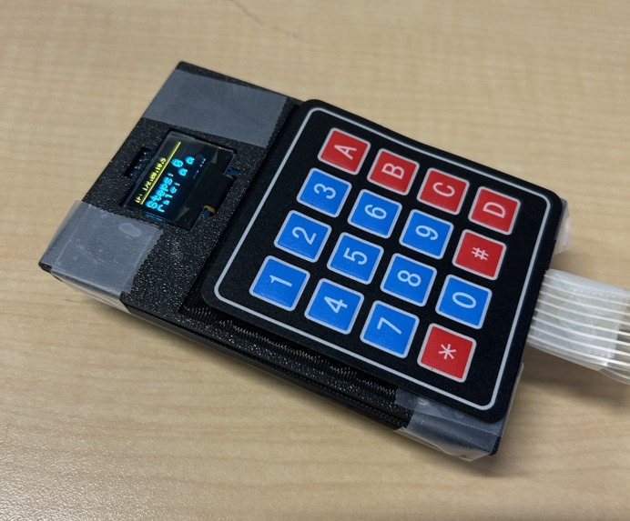

# Portable Fitness Tracker - IEEE Technothon Fall 2025

This project, created for the IEEE TAMU Technothon Fall 2025, is a portable, ESP32-based fitness tracker that helps you monitor daily activity without a smartwatch. It features a BMI calculator, a real-time step counter, and a calorie burn estimator.

The user inputs their weight and height via a 4x4 keypad, and their calculated BMI is immediately shown on an OLED display. The device then begins tracking steps, with the step count and estimated calories burned displayed on both the OLED screen and a live web dashboard hosted directly by the ESP32.



## Features

* Enter your height and weight to get your Body Mass Index.
* An MPU-6050 IMU detects motion and uses a filtered algorithm to accurately count steps.
* Calculates an estimate of calories burned based on step count.
* Provides an on-device interface for BMI input and live display of fitness data.
* Access a simple, clean web page on your local network to see your stats in real-time from any device.

## Hardware Components

*   ESP32 Development Board
*   MPU-6050 Accelerometer & Gyroscope (IMU)
*   SSD1306 0.96" I²C OLED Display (128x64)
*   4x4 Matrix Keypad
*   Breadboard and Jumper Wires
*   Custom 3D-Printed Case

## Software & Libraries

*   Adafruit SSD1306 & Adafruit GFX
*   Adafruit MPU6050
*   Keypad
*   WiFi & WebServer libraries

## Setup Instructions

### 1. Hardware Connection

Connect the components to the ESP32 according to the pinout table below.

| Component         | Pin       | ESP32 Pin |
| ----------------- | --------- | --------- |
| **OLED Display**  | `SDA`     | `GPIO 19` |
| (I²C Bus 1)       | `SCL`     | `GPIO 18` |
|                   | `VCC`     | `3.3V`    |
|                   | `GND`     | `GND`     |
| **MPU-6050 IMU**  | `SDA`     | `GPIO 21` |
| (I²C Bus 0)       | `SCL`     | `GPIO 22` |
|                   | `VCC`     | `3.3V`    |
|                   | `GND`     | `GND`     |
| **Keypad Rows**   | `R1`      | `GPIO 32` |
|                   | `R2`      | `GPIO 33` |
|                   | `R3`      | `GPIO 25` |
|                   | `R4`      | `GPIO 26` |
| **Keypad Columns**| `C1`      | `GPIO 27` |
|                   | `C2`      | `GPIO 14` |
|                   | `C3`      | `GPIO 12` |
|                   | `C4`      | `GPIO 13` |

### 2. Software Setup

1.  Install Arduino IDE and add the ESP32 board manager.
2.  Install all of the libraries listed above.
3.  Update Network's SSID and password:
    ```cpp
    const char* ssid = "YOUR_WIFI_SSID";
    const char* password = "YOUR_WIFI_PASSWORD";
    ```
4.  Upload the main.ino code to the ESP32
5. You can see the IP address on the device's OLED screen after you enter your height and weight
6.  Enter the IP address into a web browser on a device connected to the same Wi-Fi network to access the web app.

## Team

*    Jennie Nguyen: Programmed the OLED Display and BMI calculations
*    Karthik Gourabathuni: Programmed the IMU and Step calculations
*    WD Batteas: Designed a hardware casing to house all components